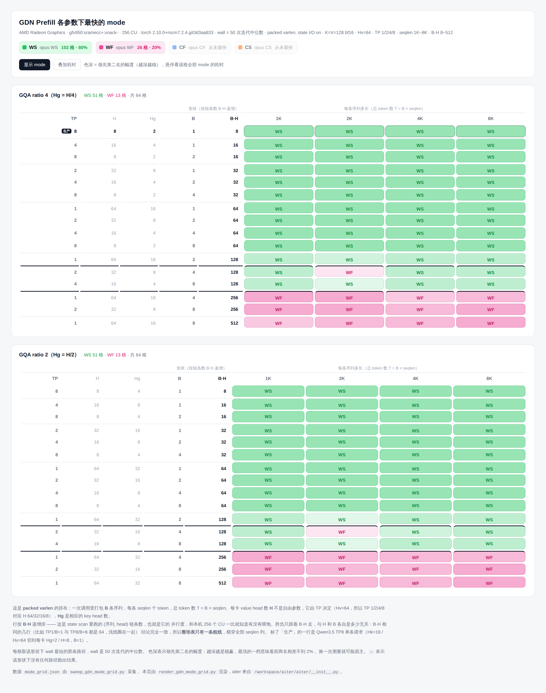
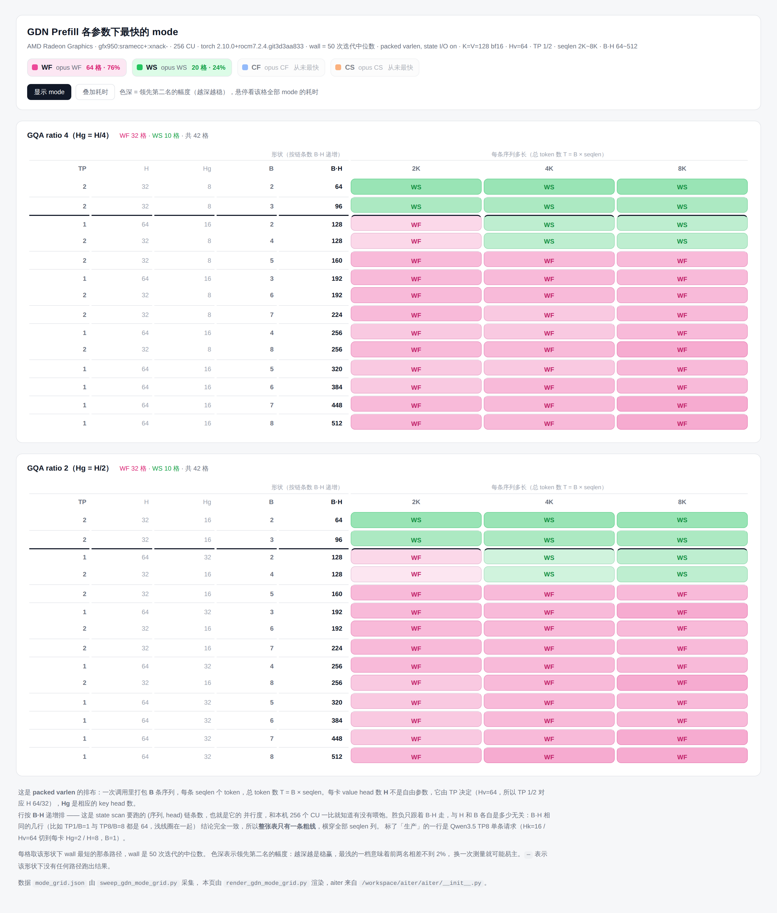

# GDN Prefill 四个 opus mode 在 MI350（gfx950）上的对比（2026-08-28）

WS / WF / CF / CS 四个 opus GDN prefill mode 在 gfx950 上的 varlen 网格对比，
与 [gfx942 基线](./gdn_prefill_backend_perf.md)（MI308X，80 CU）同口径。

**一句话结论：WS/WF 的分界线从 gfx942 的 B·H ≈ 48 右移到 gfx950 的 B·H ≈ 144，
按 CU 数等比缩放。** gfx942 上 WF 拿下 128 格中的 80 格，在 gfx950 上反过来
WS 拿 102 格、WF 只剩 26 格。CF 和 CS 两张网格上一格未赢，与 gfx942 结论一致。

## 1. 测量环境

| 项 | 值 |
| --- | --- |
| 设备 | AMD Radeon Graphics，`gfx950:sramecc+:xnack-`，**256 CU** |
| 可见设备 | `HIP_VISIBLE_DEVICES=7`（本机 8 卡，测量时全部空闲） |
| torch | 2.10.0+rocm7.2.4.git3d3aa833 |
| 分支 | `dev/huizzhan/flydsl_prefill_gdn_block` |
| HEAD | `37c5e0aff` |
| aiter | `/workspace/aiter`（用 `PYTHONPATH` 覆盖 editable 安装指向的 `/app/aiter-test`） |
| 日期 | 2026-08-28 |

口径与 gfx942 基线完全一致：`wall` 是 50 次迭代的中位数，分 kernel 时间是 20 次
迭代的 `torch.profiler` device time；packed varlen，state I/O 打开，K=V=128 bf16，
`Hv=64` 按 TP 切成每卡 `H = Hv/TP`。

## 2. 前提：CF/CS 的 gfx942 门控是临时放开的

CF/CS 原本在三处被硬编码限制到 gfx942，gfx950 上会被直接跳过：

| 位置 | 原判据 |
| --- | --- |
| `op_tests/flydsl_tests/bench_gdn_block_ws_vs_flydsl.py` | `unsupported_reason()` 里 `gfx != "gfx942"` |
| `aiter/ops/opus_gdn_c_prefill.py` | `device_gfx != "gfx942"` 时 `raise ValueError` |
| `csrc/py_itfs_cu/opus_gdn_c_prefill_kernels.cu` | `check_gfx942()` 的 `TORCH_CHECK` |

本次把三处都放宽为接受 `gfx942/gfx950`。底层 `gdn_mfma_utils.h` 本就标注
「Target: gfx942 (MI300X) / gfx950 (MI350)」，用的 `mfma_f32_16x16x16_bf16` 在
gfx950 上同样存在，所以这更像是「未验证」而非「不能跑」。**这三处改动仅用于本次
测量，未提交。**

放开后 `module_opus_gdn_c_prefill` 在 gfx950 上编译通过（26.5s），并以 WS 为基准
做了数值验证，两个并行度都通过：

| N | T | 后端 | o max diff | o mean diff | final_state max | final_state mean |
| ---: | ---: | --- | ---: | ---: | ---: | ---: |
| 1 | 8192 | WF / CF / CS | 0.000061 | 2.9e-7 | 0.000187 | 6.57e-6 |
| 8 | 65536 | WF / CF / CS | 0.000061 | 2.9~3.0e-7 | 0.000352 | 6.43e-6 |

三个 mode 相对 WS 的差异彼此一致（`|o| mean = 0.000333`），量级与 gfx942 基线第 7 节
记录的一致，属 bf16 正常累加误差。**CF/CS 在 gfx950 上功能正确，下面的性能数字
可以采信。**

## 3. 128 格网格：WS 拿下 80%

与 gfx942 同口径的网格：行是 (H, B) 按链条数 B·H 递增排，列是 seqlen，
GQA ratio 4 和 2 各一张表，共 128 格。全部跑通，用时 20 秒。

交互式版本 [`gdn-mode-by-seqlen-gfx950.html`](./gdn-mode-by-seqlen-gfx950.html)，
单文件、双击打开，悬停任意格可看该形状下 4 个 mode 的耗时与 B·H。



胜场对比：

| 平台 | CU | WS | WF | CF | CS |
| --- | ---: | ---: | ---: | ---: | ---: |
| MI308X / gfx942 | 80 | 48 格 | **80 格** | 0 | 0 |
| MI350 / gfx950 | 256 | **102 格（80%）** | 26 格（20%） | 0 | 0 |

WS/WF 耗时比随 B·H 单调上升，穿过 1.00 的位置就是分界（<1 表示 WS 更快）：

| B·H | 8 | 16 | 32 | 64 | 128 | 256 | 512 |
| --- | ---: | ---: | ---: | ---: | ---: | ---: | ---: |
| WS/WF 中位 | 0.39x | 0.43x | 0.60x | 0.75x | 0.95x | 1.29x | 1.30x |
| 赢家 | WS | WS | WS | WS | WS(22)/WF(2) | WF | WF |

对比 gfx942 同一列（基线第 10 节）：0.48x / 0.63x / 0.92x / **1.41x** / 1.41x /
1.37x / 1.43x —— gfx942 在 B·H=64 就已经翻转到 WF，gfx950 到 B·H=128 还是 WS。

## 4. 阈值定位：B·H ≈ 144，即 0.56 × CU

主网格的行只能取到 TP 给出的 B·H ∈ {8,16,32,64,128,256,512}，翻转点被卡在
128 和 256 之间。用 `--tps 1 2 --n-seqs 2..8` 把 B·H 加密到 64~512 再扫一遍
（84 格，27 秒）：

交互式版本 [`gdn-mode-by-seqlen-gfx950-threshold.html`](./gdn-mode-by-seqlen-gfx950-threshold.html)



| B·H | 64 | 96 | 128 | 160 | 192 | 224 | 256 | 512 |
| --- | ---: | ---: | ---: | ---: | ---: | ---: | ---: | ---: |
| WS 赢 | 6 | 6 | 8 | 0 | 0 | 0 | 0 | 0 |
| WF 赢 | 0 | 0 | 4 | 6 | 12 | 6 | 12 | 6 |
| WS/WF 中位 | 0.75x | 0.87x | 0.96x | 1.15x | 1.22x | 1.19x | 1.24x | 1.30x |
| 极差 | [0.73,0.78] | [0.85,0.91] | [0.93,1.06] | [1.11,1.17] | [1.16,1.27] | [1.16,1.30] | [1.20,1.33] | [1.25,1.32] |

（表里省掉了 B·H = 320 / 384 / 448 三档，它们同样是 WF 全胜，中位 1.10x / 1.22x / 1.28x。）

- **B·H ≤ 96**：WS 全胜，领先 13~25%。
- **B·H = 128**：过渡带，比值 0.93~1.06，两者差距在 7% 以内。4 个 WF 胜全部出现在
  最短的 seqlen=2K 列，4K/8K 列仍是 WS。
- **B·H ≥ 160**：WF 全胜，稳定领先 11~30%。

所以阈值在 128 与 160 之间，取 **144**。与 gfx942 对照：

| 平台 | CU | 翻转阈值 B·H | 阈值 / CU |
| --- | ---: | ---: | ---: |
| MI308X / gfx942 | 80 | ~48（基线用更细网格收窄到 40~48） | 0.60 |
| MI350 / gfx950 | 256 | ~144 | 0.56 |

两代硬件上阈值都落在 **0.56~0.60 × CU 数**。这与基线给出的机理解释吻合：链条数
逼近 CU 数时，融合 persistent kernel 才喂得饱；链条数远小于 CU 数时，拆成多个
kernel 反而能把机器铺满。CU 从 80 涨到 256，能喂饱 WF 所需的链条数就等比上移。

seqlen 依然基本不进入判据：粗线横平地穿过全部列，唯一的例外是过渡带 B·H=128 上
短 seqlen 略偏 WF，而那里两者差距不到 7%，实用上可以忽略。

## 5. 为什么阈值会右移：分 kernel 拆解

生产形状（TP=8，Hg=2/H=8，seqlen=8192，packed varlen，state I/O on）：

### N=1，T=8192，B·H=8（us）

| scheme | front | K5 | K6 | K5+K6 | other | total | wall | vs WS |
| --- | ---: | ---: | ---: | ---: | ---: | ---: | ---: | ---: |
| opus WS | 23.1 | 206.0 | **23.3** | - | - | 252.5 | **253.6** | 1.00x |
| opus WF | 25.4 | - | - | 767.5 | - | 792.9 | 795.6 | 3.14x |
| opus CF | 12.3 | - | - | 1504.1 | 4.8 | 1521.2 | 1524.9 | 6.01x |
| opus CS | **11.2** | 469.3 | 23.8 | - | 4.6 | 508.8 | 510.9 | 2.01x |

### N=8，T=65536，B·H=64（us）

| scheme | front | K5 | K6 | K5+K6 | other | total | wall | vs WS |
| --- | ---: | ---: | ---: | ---: | ---: | ---: | ---: | ---: |
| opus WS | 153.4 | 412.1 | **148.9** | - | - | 714.4 | **716.3** | 1.00x |
| opus WF | 156.7 | - | - | 853.7 | - | 1010.4 | 1011.8 | 1.41x |
| opus CF | 54.2 | - | - | 1600.5 | 4.7 | 1659.4 | 1660.3 | 2.32x |
| opus CS | **51.0** | 825.6 | 152.7 | - | 4.8 | 1033.9 | 1034.5 | 1.44x |

关键在于 gfx950 上各段的加速倍数**极不均匀**（同形状，gfx942 → gfx950）：

| 段 | 性质 | gfx942 | gfx950 | 加速 |
| --- | --- | ---: | ---: | ---: |
| front（K1..K4） | 并行度高，吃 CU 数 | 121.9 | 23.1 | **5.3x** |
| K5 state scan | 沿序列串行的递推链 | 280.4 | 206.0 | 1.36x |
| K6 output | 并行度高，吃 CU 数 | 135.0 | 23.3 | **5.8x** |

（N=1 的 WS 三段；N=8 时同样是 6.2x / 2.7x / 7.4x。）

state scan 是沿序列的串行递推，加宽机器帮不上忙，只能拿到 1.4~2.7x；front 和 K6
是纯并行段，直接吃满 256 CU，拿到 5~7x。于是在 gfx950 上，WS 的两个便宜段变得
**几乎免费**（23.1 + 23.3 = 46.4us，占 wall 的 18%），瓶颈几乎只剩 K5；而 WF 把
K5 和 K6 融进一个 persistent kernel，省下的中间张量往返和 kernel 启动本来是它的
全部本钱，在 gfx950 上这笔本钱不值钱了。

WF 那个融合 kernel 的固定成本特征依旧：N=1 到 N=8（T 涨 8 倍）只从 767.5 涨到
853.7us（+11%），几乎不随 T 增长 —— 这正是它在链条足够多时能赢的原因，也是它在
链条少时惨败的原因。CF 的融合 kernel 同理（1504.1 → 1600.5），但固定成本高出一倍，
所以全程垫底。

## 6. CF/CS：在这张网格上依然零胜

放开门控测出来的结果与 gfx942 结论一致 —— C 家族的价值域不在这张网格覆盖的范围里。
各 mode 相对当格最优的倍数（gfx950 主网格 128 格）：

| mode | 中位 | 最好 | 最差 |
| --- | ---: | ---: | ---: |
| WS | 1.00x | 1.00x | 1.37x |
| WF | 1.35x | 1.00x | 3.13x |
| CS | 1.39x | 1.06x | 2.03x |
| CF | 2.30x | 1.60x | 5.97x |

C 前端确实是最便宜的（N=1 时 front 11.2us，比 W/U 的 23.1us 便宜一半；N=8 时
51.0 vs 153.4，便宜三分之二），但这笔账在 scan 里加倍还回去：CS 的 K5 是 469.3us
（N=1），是 WS 的 2.3 倍，因为 W/U 要在 scan kernel 里重建。净结果 CS 落后当格
最优 39%（中位）。

## 7. 950 相对 942 的整体加速

同 `(GQA ratio, H, B, seqlen)` 逐格比对 wall（128 格全部配对成功）：

| mode | 中位加速 | 区间 |
| --- | ---: | --- |
| WS | **4.20x** | [1.85, 5.78] |
| CS | 2.83x | [1.59, 5.49] |
| WF | 2.22x | [1.57, 5.37] |
| CF | 2.09x | [1.49, 4.63] |

WS 的中位加速最高（4.20x），因为它在高 B·H 区域最吃 CU 数 —— 那些格子在 80 CU 上
本来是塞不下的。生产配置那一行（TP=8，H=8，B=1，B·H=8）并行度最低，只能拿到
硬件本身的提升：

| seqlen | gfx942 WS | gfx950 WS | 加速 | gfx950 WF | gfx950 CF | gfx950 CS |
| ---: | ---: | ---: | ---: | ---: | ---: | ---: |
| 1K | 109.2 | **56.0** | 1.95x | 117.4 | 203.6 | 81.3 |
| 2K | 168.9 | **82.9** | 2.04x | 214.4 | 381.2 | 145.4 |
| 4K | 293.2 | **138.2** | 2.12x | 409.7 | 771.7 | 265.7 |
| 8K | 538.7 | **254.1** | 2.12x | 795.2 | 1516.3 | 511.0 |

## 8. 对 dispatch 的含义

gfx942 上的规则是 `B·H ≥ 48 → WF`。**这条规则不能直接搬到 gfx950**：在 gfx950 上
B·H ∈ [48, 144) 这一大段仍然该选 WS，照搬会在 B·H=64 的格子上慢约 33%（WS/WF
中位 0.75x）。

gfx950 上对应的规则是 `B·H ≥ 144 → WF`，否则 WS。判据仍然只要 `cu_seqlens` 的
长度和 H，host 侧现成。更一般地，两代硬件都符合 `B·H ≥ 0.56 × CU → WF`，可以用
`multi_processor_count` 直接算，不必逐架构打表 —— 但这条缩放律目前只有两个数据点
（80 CU 和 256 CU）支撑。

注意 `path="auto"` 在 packed batch 下恒选 WS。在 gfx950 上这个默认反而比 gfx942
更合理：128 格里它只在 WF 获胜的 26 格上吃亏（其中 24 格是 B·H ≥ 256，中位慢
29%）；而在 gfx942 上它有 80 格吃亏。

## 9. 复现

```bash
cd /workspace/aiter
# CF/CS 需要先放开第 2 节列出的三处 gfx942 门控
export PYTHONPATH=/workspace/aiter    # 覆盖 editable 安装指向的 /app/aiter-test

# 第 3 节的 128 格主网格（20s）
HIP_VISIBLE_DEVICES=7 python op_tests/flydsl_tests/sweep_gdn_mode_grid.py \
    --hv 64 --tps 1 2 4 8 --n-seqs 1 2 4 8 --seqlens 1024 2048 4096 8192 \
    --out op_tests/flydsl_tests/gdn_prefill_mode_grid_gfx950.json

# 第 4 节的阈值细化网格（27s）
HIP_VISIBLE_DEVICES=7 python op_tests/flydsl_tests/sweep_gdn_mode_grid.py \
    --hv 64 --tps 1 2 --n-seqs 2 3 4 5 6 7 8 --seqlens 2048 4096 8192 \
    --out op_tests/flydsl_tests/gdn_prefill_mode_grid_gfx950_threshold.json

# 渲染网页 + 整页截图
for tag in "" "_threshold"; do
  suffix=$(echo "$tag" | tr '_' '-')
  python op_tests/flydsl_tests/render_gdn_mode_grid.py \
      --json op_tests/flydsl_tests/gdn_prefill_mode_grid_gfx950${tag}.json \
      --out docs/gdn-mode-by-seqlen-gfx950${suffix}.html
  python op_tests/flydsl_tests/shot_gdn_mode_grid.py \
      --html docs/gdn-mode-by-seqlen-gfx950${suffix}.html \
      --out docs/images/gdn-mode-by-seqlen-gfx950${suffix}.png
done

# 第 5 节的分 kernel 拆解与第 2 节的数值验证
for b in ws wf cf cs; do
  HIP_VISIBLE_DEVICES=7 python op_tests/flydsl_tests/bench_gdn_block_ws_vs_flydsl.py \
      --backend $b --n-seqs 1 --outdir /tmp/gdn950/verify
done
python op_tests/flydsl_tests/bench_gdn_block_ws_vs_flydsl.py \
    --report --compare --outdir /tmp/gdn950/verify
```

截图脚本需要 `pip install playwright && playwright install chromium` 以及
`playwright install-deps chromium`（本环境缺 `libatk-1.0.so.0` 等系统库）。

## 10. 相关文件

| 文件 | 说明 |
| --- | --- |
| `docs/gdn_prefill_mode_gfx950.md` | 本文档 |
| `docs/gdn-mode-by-seqlen-gfx950.html` | 第 3 节 128 格网格的交互式网页 |
| `docs/images/gdn-mode-by-seqlen-gfx950.png` | 同一张网格的静态截图 |
| `docs/gdn-mode-by-seqlen-gfx950-threshold.html` | 第 4 节阈值细化网格的交互式网页 |
| `docs/images/gdn-mode-by-seqlen-gfx950-threshold.png` | 同上的静态截图 |
| `op_tests/flydsl_tests/gdn_prefill_mode_grid_gfx950.json` | 主网格原始数值（128 格 × 4 mode） |
| `op_tests/flydsl_tests/gdn_prefill_mode_grid_gfx950_threshold.json` | 阈值网格原始数值（84 格 × 4 mode） |
| `op_tests/flydsl_tests/shot_gdn_mode_grid.py` | 网页整页截图脚本（本次新增） |
| `docs/gdn_prefill_backend_perf.md` | gfx942 基线，本文档的对照 |
